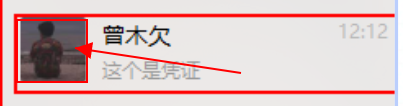
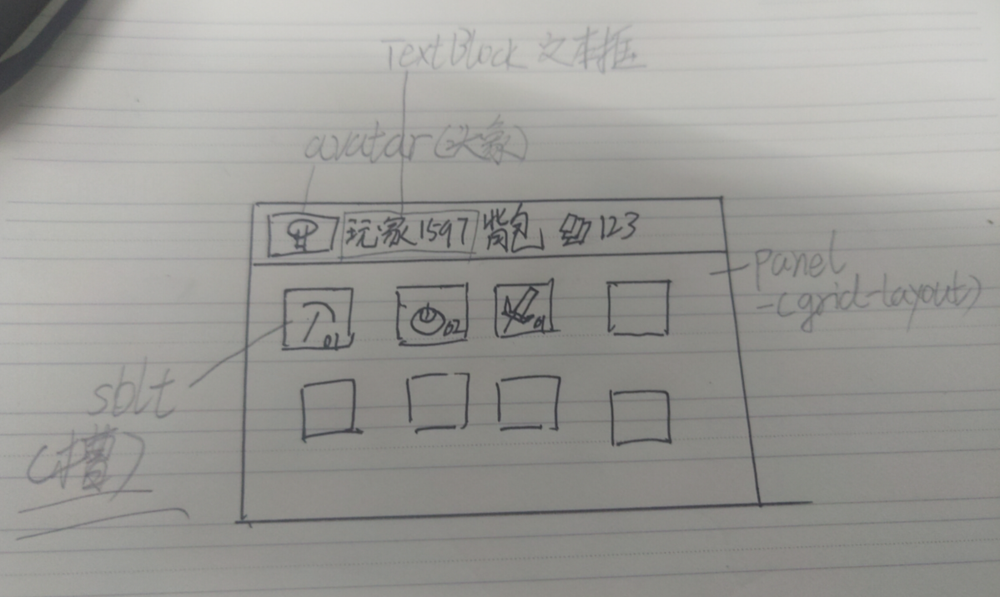
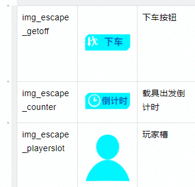
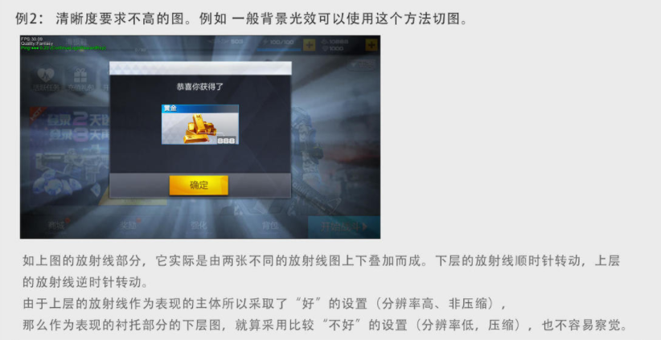

# 命名与切图

<https://www.jianshu.com/p/a254630afd65>

<https://blog.csdn.net/zhangqi323/article/details/52368931>

## UI命名

UI的命名

-   只能使用英文大小写，数字和下划线命名，禁止出现空格，文中，括号等其他符号

-   类型\_模块\_子模块\_变种 进行命名.

-   \<WidgetType\>_\<Module\>_\<SubModule\>_\<Submodule\>_\<Variant\>

一般来说

-   Module对应的是WidgetBluePrint.
    你这个UI的名字叫什么,那么与这个所属的切图的Model就是什么

-   SubModule对应的是你这个UI中"Panel(面板)"类型控件

比如说我们做了一个qq界面,命名为

```
WBP_Login 
```
那么我们的UI名字就是

```
 UI_Login\_\<类型\>_\<子区域\>_\<名字\>_\<变种\> 
```

比如说QQ,我们可以分成以下几个区域

-   Banner(横幅)

-   Setting(登陆设置)

-   LoginField(登陆方式,账号和密码)

这几个区域均属于不同的"面板"

那么**横幅** 就是

```
UI_Login_bn_Banner

我是UI资源,我属于Login这个UI蓝图, 我是bn(横幅类型),我在Banner模块(Panel)
登陆控件的Banner模块的,没有名字与变种的横幅
```

我们的**QQ登陆** 就是

```
UI_Login_Bnt_LoginField_QQ
```


**命名的细化**

软件中的Icon(图标)其实是图片(Image)的一种,你的头像(Avatar)其实是图标(Icon的一种)



比如说你在设计背包的时候



这个槽(Solt)与头像(Avatar)一样,可以从图标(Icon)中独立出来

**只要一类图片,拥有特定的用处,那么你就可以弄一份特定的"类型"**

**类型对照表**

| \<WidgetType\> | 缩写   | 全名       | 参考                          |
|----------------|--------|------------|-------------------------------|
| 按钮           | Bnt\_  | button     |                               |
| 背景           | Bg\_   | background | 桌面背景 王者荣耀背景         |
| 图标           | Icon\_ | icon       |                               |
| 图片           | Img\_  | image      | 不知道干啥的图标              |
| 头像           | av\_   | avatar     | 你的QQ头像                    |
| 进度条         | pb\_   | processabr | 打开王者荣耀时候的进度条      |
| 横幅           | bn\_   | banner     | 你平常上网,看到的"滚动"的图片 |
|                |        |            |                               |
|                |        |            |                               |

## 变种与参数

**按钮**

| 按钮\_悬浮   | bnt_xxx_h | hovering | 鼠标悬停,鼠标放上去的样子                |
|--------------|-----------|----------|------------------------------------------|
| 按钮\_按下   | bnt_Xxx_p | pressed  | 按钮按下,按下时候的样子                  |
| 按钮\_默认   | bnt_xxx_d | default  | 默认状态下                               |
| 按钮\_未启用 | bnt_xxx_d | disabled | 按钮未启用,平常用户协议未同意,按钮的样子 |

**进度条**

| 进度条\_框框 | pb_xxx_o | outline | 框框 |
|--------------|----------|---------|------|
| 进度条\_填充 | pb_xxx_f | fill    | 填充 |

## UI切图

**切图的目的**

切图的目的是把你画出来的设计稿,切成一个一个部分,然后交给前端开发人员组合起来.

比如说Mico设计的


被我们拆成了(不要问我为什么就这么一点点,因为没画完呢)



比如说这个背景,是连成一块的, 你就可以直接把背景挖一块出来

这个人,有6个都是重复的,你就切一个就可以了

**怎么切**

ui切图很简单:

-   原样的设计图

-   把你的每一个图层写下来,大小按照原来的大小就可以了.

-   有透明通道的以png保存,没有的以jpg保存,一般背景都是不透明的

注意: 如果有"重复"的,或者说纯色块,只需要写一点点就可以了

**纯色块**


**平铺图案**


**可缩小的图片**



