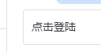
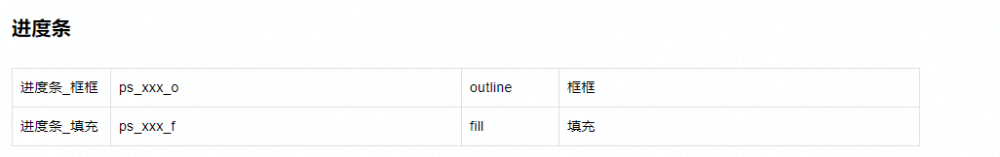

# 资源存放

设计-UI-逃脱

## 表格样式

1.  修改记录

2.  制作者(写前端与设计师,如果已在tower等管理软件中写入,可忽略)

3.  贴图内容

4.  介绍有哪些资源

5.  那些资源的结构图

6.  打包好的文件

| 资产命名     | 资产类型 | 文件/图片                                                 | 描述 | 所属模块 |
|--------------|----------|-----------------------------------------------------------|------|----------|
| UI_Login_Bnt | UI       |   |      | Login    |

**常见资源类型以及前缀**

| 类型                 | 前缀 | 描述                        |
|----------------------|------|-----------------------------|
| 字体(Font)           | F\_  | 文字的字体                  |
| 视频(Video)          | V\_  | 播放视频的文件              |
| 特效(ParticleSystem) | PS\_ | 特效                        |
| 设计图(prototype)    | PT\_ | 用于在设计完成后进行对照    |
| UI切图(UI)           | UI\_ | 在UMG视图中编辑拼图用的图片 |

## 结构图

结构图的目的是,让前端快速知道这个东西,是属于哪一个模块的.类似研发文档中的"结构图"

| Bash WBP_Login//控件名字 - LoginButton(控件名字):Image(控件类型) image=bnt_login (控件参数) - Image: image=img_someimage  |
|---------------------------------------------------------------------------------------------------------------------------|

关于控件的参数,默认情况下写一个 **image=(切图名字)** 就可以了.

其他情况参考: 指南-UI-命名与切图



比如说我们的进度条有 outline,fill两个参数

```
WBP_Loading
- LoadProgessBar(控件名字):pb(控件类型) outline=bnt_login (控件参数outline) fill=(控件参数fill)

```
