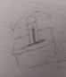
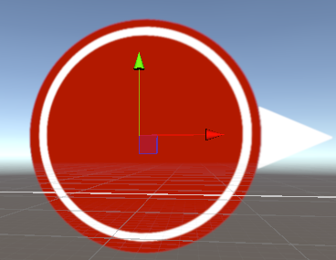
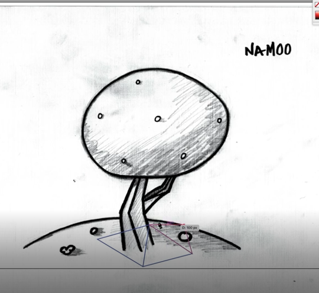
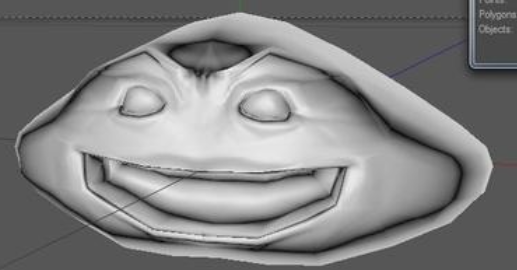
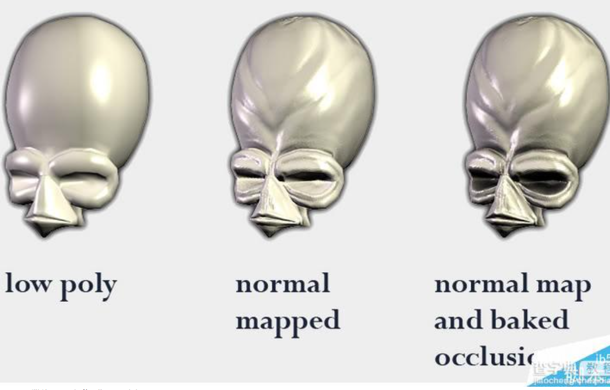
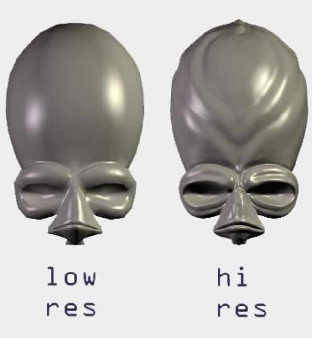
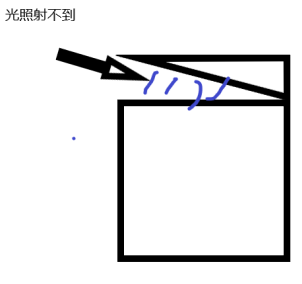
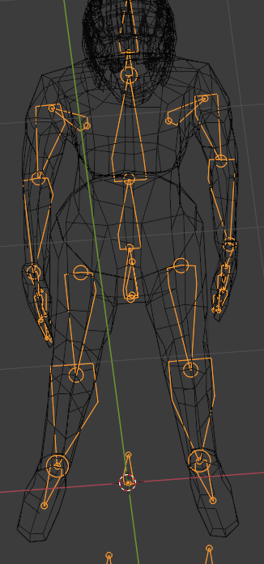

# 美术知识

本章节,主要是对各种专业名词进行通用的解释.

因为策划首先得是个程序,所以这里没有与程序交流的东西

## 2d

**Spine**

[Spine官网](http://zh.esotericsoftware.com/)

Spine是2d动画的骨架,什么是2d动画呢? 比如说你制作了一个拉杆

这个拉杆由底座和拉杆组成. 咱们拉杆使用的时候,得上下拉拉杆

咱们制作动物的时候,动物摇尾巴,也可以理解为拉杆剩下摇动.

这个拉杆就是骨骼

**层级**

层级就是两个图片显示的次序

这个图标是由两个图片组成的

什么是层级呢? 就是这两个图片谁在前谁在后

上图就是把箭头拖到红色圆圈后面的结果

提示: 层级一般与Z轴有关, 当Z轴靠近相机,层级则增加,Z轴远离相机,层级则减少

## 通用

**线稿**

线稿是一个非常抽象的概念.

就是一个美术资源,我们还没开始正式制作之前画的草图,都叫线稿

线稿的分类:

-   UI线稿

-   2D场景线稿

-   3d场景线稿

-   模型线稿

**烘培**

烘培,是预处理数据的通用名词,程序中的计算和建模中的法线,AO的常用名词.

比如说,你要计算99乘法表,你有两种方法

-   每次需要的时候计算一下

2x3=2个3相加=6

5x5=5个5相加=25

-   或者说你可以烘培一下

就是预先把99乘法表的结果记下来

别人问你2x3=?你看了一下,自己有记载2x3=6

别人问你9x9=? 你的笔记本上写着 9x9=81

总结一下,烘培就是把东西预先做好,用的时候不需要再去做,直接用

-   对于程序: 烘培就是上面的99乘法表例子

-   对于AO: 烘培就是预先计算一下,光到这里会变暗

-   对于法线: ..我也不太好描述,希望后人可以把这一块补上

## 场景

**环境光**

环境光,就是MineCraft中荧石,火把,这类向四周发射光源的东西

**方向光**

方向光是天空中射下来的光

**反光**

## 模型

**法线**

[知乎](https://zhuanlan.zhihu.com/p/91330165)

[参考文档](https://jc.chazidian.com/news181775/)

法线,说简单一点,就是让低模显示出高模型的效果

高模,就是细节很多的模型,低模就是细节很少的模型.

低模+法线

请忽略这个帽子,这个帽子是后面加上去的,专注于脸就可以了

最左边: 外星人低模

中间: 低模+高模型

右边: 低模+高模型+AO

上图的低模和上图的高模型

法线贴图是由高模烘培后的贴图,让低模+法线可以展现出和高模差不多的效果.

**AO(环境光遮蔽)**

[参考文档](https://jc.chazidian.com/news181775/)

环境光遮蔽, 就是阴影,比如说这种模型有夹缝,夹缝是照不到的,所以会显得黑

左图: 无AO 右图: 有AO

AO只是对光线的遮挡,即如果光射到这里,会减少多少.

至于射入的光的方向,就和AO无关了

**骨骼**

骨骼就是橙色的线

IK/FK

动画机

蒙皮

Blend

权重
## 特效

**特效**

特效就是一个会程序的美术..

[参考文档](https://blog.csdn.net/a962035/article/details/80331846)

**顶点**

比如说水面流动,草浮动

**片元**

比如说disco球

**粒子系统**
Nigara

## 运营

**ELO**

**MMR**
