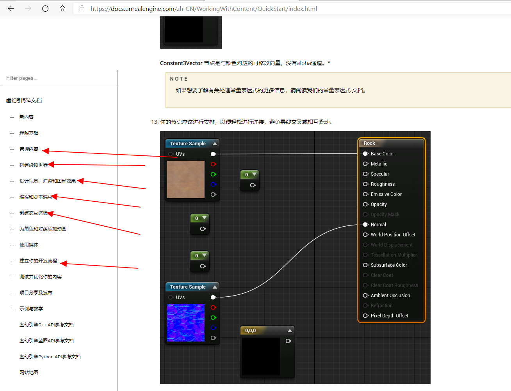

**写这个的时候,是我的团队刚刚转向UE4的时候,因此不是很好,只可以拿去作为参考**

| 项        | 完成日期  | 总耗时  | 评分  |
|-----------|-----------|---------|-------|
| 面向对象  |           |         |       |
| 环境配置  |           |         |       |
| 引擎入门  |           |         |       |
| 团队协作  |           |         |       |
| 编程进阶  |           |         |       |
| 网络通信  |           |         |       |

# 环境配置 

## 参考文档 

| 软件名字    | 类型      | 描述                            | 下载地址                                                                   |
|-------------|-----------|---------------------------------|----------------------------------------------------------------------------|
| UE4         | 游戏引擎  | 虚幻4.26.2                      | https://www.unrealengine.com/zh-CN/download                                |
| PlasticSCM  | 版本控制  | Plasticscm10                    | [Plastic SCM - Download Plastic SCM](https://www.plasticscm.com/download)  |
| Rider       | 编程软件  | 需要以VS作为前置, 专门的UE4开发 | <https://www.jetbrains.com/lp/rider-unreal/>                               |
| VS          | 编程软件  | 一般开发                        | https://visualstudio.microsoft.com/zh-hans/vs/                             |

# 引擎基础 

## 评分表 

| 项        | 类型      | 描述                                 | 地址                              | 评分  |
|-----------|-----------|--------------------------------------|-----------------------------------|-------|
| 资源导入  | 基础      | 模型导入,UI导入                      | 虚幻4文档/管理内容                |       |
| 资产制作  | 基础      | 将美术资源,技术资源根据要求进行整合  |                                   |       |
| 大致构架  | 基础      | 各种大概的构架                       | 虚幻4文档/创建交互体验            |       |
| 动画      | 动画      | 动画的设计与制作                     | 虚幻4文档/为角色和对象添加动画    |       |
| 关卡设计  | 地图编辑  | 地图编辑器的使用                     | 虚幻4文档/构建虚拟世界            |       |
| 特效设计  | 特效师    | Material，nigara这些特效类设计       | 虚幻4文档/设计视觉渲染和图像效果  |       |
| 代码编纂  | 客户端    | 代码编写                             | 虚幻4文档/编程与脚本编写          |       |

## 参考文档 

| Unity 官方手册  | Unity  | https://docs.unity3d.com/cn/current/Manual/index.html  |
|-----------------|--------|--------------------------------------------------------|
| UE4官方手册     | UE4    | https://docs.unrealengine.com/zh-CN/index.html         |
| UE4社区知识库   | UE4    | https://ue4community.wiki/                             |

# 团队协作 

## 评分标 

| 项              | 介绍                                          | 评分  | 权重  |
|-----------------|-----------------------------------------------|-------|-------|
| 工作流          | 熟悉我们的工作流                              |       | 3     |
| 资产管理        | 程序命名规范,资产管理规范                     |       | 3     |
| 分支,提交,合并  | Plasticscm CheckIn Checkout Branching Merge   |       | 2     |
| 团队规范        | 分支规范,Commit规范,Issue,代码                |       | 3     |

## 参考文档 

| 项         | 文档地址                                                                                                                                             | 描述  |
|------------|------------------------------------------------------------------------------------------------------------------------------------------------------|-------|
| 工作流     | [档案-合作方式](https://e9vcyi9mlw.feishu.cn/docs/doccnqJgvxyBkyJRkiIZfkUEYUd)                                                                       |       |
| 代码规范   | [Coding Standard \| Unreal Engine Documentation](https://docs.unrealengine.com/en-US/ProductionPipelines/DevelopmentSetup/CodingStandard/index.html) |       |
| PlasticScm | <https://www.plasticscm.com/documentation>                                                                                                           |       |

# 编程模式 

## 评分 

设计模式

| 项                | 简介  | 评分  |
|-------------------|-------|-------|
| 单例              |       |       |
| 命令              |       |       |
| 享元              |       |       |
| 状态(有限状态机)  |       |       |
| 观察者            |       |       |

序列模式

| 双缓冲    |   |   |
|-----------|---|---|
| 游戏循环  |   |   |
| 更新方法  |   |   |

行为模式

| 字节码    |   |   |
|-----------|---|---|
| 子类沙箱  |   |   |
| 类型对象  |   |   |

解耦模式

| 组件模式  |   |   |
|-----------|---|---|
| 事件列队  |   |   |
| 服务定位  |   |   |

优化模式

| 局部数据  |   |   |
|-----------|---|---|
| 脏标记    |   |   |
| 对象池    |   |   |
| 空间分区  |   |   |

## 参考文档 

| 名字             | 平台  | 类型  | 地址                                                                                                                                                                                                                                                                                                                                       |
|------------------|-------|-------|--------------------------------------------------------------------------------------------------------------------------------------------------------------------------------------------------------------------------------------------------------------------------------------------------------------------------------------------|
| 游戏编程模式     | 通用  | -     | https://gpp.tkchu.me/                                                                                                                                                                                                                                                                                                                      |
| FSM(有限状态机)  | 通用  | FSM   | https://www.jianshu.com/p/d48e0d565618                                                                                                                                                                                                                                                                                                     |
| LogicDriverPro   | UE4   | FSM   | [虚幻插件：Logic Driver Pro 终极状态机插件初探\_开发游戏的老王-CSDN博客](https://orzgame.blog.csdn.net/article/details/111571051)                                                                                                                                                                                                          |
| AI状态机         | UE4   | FSM   | https://zhuanlan.zhihu.com/p/88065182javascript:void(0)                                                                                                                                                                                                                                                                                    |
| Delegate         | UE4   | Event |  [Unreal Engine 4 C++自定义事件\_shangguanwaner的专栏-CSDN博客](https://blog.csdn.net/shangguanwaner/article/details/48622597?utm_medium=distribute.pc_relevant.none-task-blog-BlogCommendFromMachineLearnPai2-1.add_param_isCf&depth_1-utm_source=distribute.pc_relevant.none-task-blog-BlogCommendFromMachineLearnPai2-1.add_param_isCf) |

# 框架与组件常见插件

| 项                               | 介绍  | 评分  |
|----------------------------------|-------|-------|
| GamePlay框架                     |       |       |
| GAS                              |       |       |
| MovemtnComponent                 |       |       |
| OnlineSubSystem/EpicOnlineSystem |       |       |

参考文档

| 名字          | 平台  | 类型              | 地址                                                                                                                           |
|---------------|-------|-------------------|--------------------------------------------------------------------------------------------------------------------------------|
| 游戏编程模式  | 通用  | MovementComponent | <https://auraforge.ca/2019/03/16/unreal-engine-4-custom-physics-mode-for-movement-component/>                                  |
|               |       | wiki              |                     |
|               |       | MovementComponent |  <https://nerivec.github.io/old-ue4-wiki/pages/custom-character-movement-component.html>                                       |
|               |       | GAS               | <https://docs.unrealengine.com/zh-CN/InteractiveExperiences/GameplayAbilitySystem/index.html>                                  |
|               |       | EOS/OSS           | [在线子系统 \| 虚幻引擎文档 (unrealengine.com)](https://docs.unrealengine.com/zh-CN/ProgrammingAndScripting/Online/index.html) |
|               |       | UMG               | 我们整理的widget介绍                                                                                                           |

☐[漏了一个ue4 community wiki](https://ue4community.wiki/)

# 网络通信 

## 评分 

| 项        | 介绍  | 评分  |
|-----------|-------|-------|
| TCP&UPD   |       |       |
| 基本原理  |       |       |
| 变量同步  |       |       |
| RPC       |       |       |
| C/S模式   |       |       |

## 参考文档 

| 项        | 平台    |                                                                                                                                                                                                                                                                                         |      |
|-----------|---------|-----------------------------------------------------------------------------------------------------------------------------------------------------------------------------------------------------------------------------------------------------------------------------------------|------|
| UE4-WIKI  | UE4     | https://www.ue4community.wiki/legacy/network-replication-using-replicatedusing/repnotify-vars-2bl75t21\#server-rep                                                                                                                                                                      |      |
| UE4原生   | ue4     | [联网和多人游戏 \| 虚幻引擎文档 (unrealengine.com)](https://docs.unrealengine.com/zh-CN/InteractiveExperiences/Networking/index.html)                                                                                                                                                   |      |
| Photon    | 全平台  | https://doc.photonengine.com/en-us/realtime/current/getting-started/realtime-intro                                                                                                                                                                                                      |      |
| 玄东Wong  | UE4     | [[UE4]Server RPC 函数的正确定义方式\_玄冬Wong-CSDN博客](https://blog.csdn.net/wag2765/article/details/84762916?utm_medium=distribute.pc_relevant.none-task-blog-BlogCommendFromBaidu-5.control&depth_1-utm_source=distribute.pc_relevant.none-task-blog-BlogCommendFromBaidu-5.control) |      |
| Dawnarc   | UE4     | [[UE4]Networking in Basic - Simple Replication Example (dawnarc.com)](https://dawnarc.com/2017/02/ue4networking-in-basic-simple-replication-example/)                                                                                                                                   | 精品 |
|           |         |                                                                                                                                                                                                                                                                                         |      |

# 防作弊 

| 项             | 简介                               | 评分(10分制)  |
|----------------|------------------------------------|---------------|
| 作弊-联网权限  | ..... 这个我不知道怎么说 太基础了  |               |
| 作弊-内存修改  | 通过作弊器修改内存                 |               |
| 作弊-代理挂机  | 使用程序模拟玩家进入游戏           |               |
| 作弊-透视类    | 让玩家可以透过强瞄准               |               |
| 作弊-速度类    | 通过修改"发送频率"或者其他         |               |

[作弊与反作弊系统-vis2k](https://e9vcyi9mlw.feishu.cn/docs/doccnZ2nrxduQrPFM779U6GmmSS)

# 文档编写 

## 评分 

| 项               | 简介                                                                | 评分  |
|------------------|---------------------------------------------------------------------|-------|
| 时间管理         | 正确判断大概所需工作时                                              |       |
| 需求(非联网)     | 针对单机游戏的用法文档                                              |       |
| 需求分析(联网)   | 针对联机游戏的编写  那些需要同步,那些不需要                         |       |
| 编程模式(构架)   | 能否使用正确的编程模式进行编写  最常见的就是  状态机  命令  观察者  |       |
| 结构编写         | 编写正确的结构体                                                    |       |
| 引用             | 引用其他的文档                                                      |       |

## 参考文档 

| 项                | 简介                                                                                 |   |
|-------------------|--------------------------------------------------------------------------------------|---|
| 研发文档编写指南  | [指南-系统/研发-编纂](https://e9vcyi9mlw.feishu.cn/docs/doccnIy0mHURZG4iQjrlUEfwO6b) |   |
