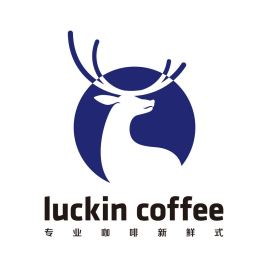

# 饥饿导致的智力提高

**有更好的修改的建议,欢迎开一个Issue提出**

本人在大学期间由于生活费不足,导致有的时候饭都吃不饱.
- 于是发现, 自从吃的少了,不喝饮料了,大脑瞬间清醒了.

需要注意,本文可能是伪科学,我并没有进行相应的研究,是通过实践得到的结论.
注意,本文仅适用于**智力劳动者**.

请准备DuolingoApp,在食用早餐的时候,能够学一会儿外语.
- [DuolingGo英语考试](https://englishtest.duolingo.cn/)
- [Duolingo在线学习](https://www.duolingo.cn/)

学英语没啥用,烂大街.
- 日语 游戏公司,音乐
- 俄语 对外贸易,科研
 

## 方法

**吃的太多会困,吃的太少会饿晕,请自行依据自己调整食量**

**不要喝其他饮料,比如说 可乐**

早上- 7:30
- 早上好,稍微运动运动,开始一天吧.
- 早餐
- 饮料
- 左旋肉碱
- 小跑500M

日常工作 8:30~12:00
- 指的是不需要很耗闹的工作
- 行政: 合同整理
- 销售: 回复邮件
- 程序: 代码编写
- 数学: 数学计算
- 咱们坐办公室的,前一个小时,不都得逛逛各种东西,回复邮件什么的.

补餐-10:30 或 15:00
- 左旋肉碱
- 水果

午餐: 11:30
- 为了下午的高强度工作做准备
- 肉
- 淀粉制品
- 咖啡
- 蔬菜

**午觉 是必须的,让你感觉更精神**

高强度工作 13:00~17:00
- 指的是需要思考,脑子炸裂的工作
- 行政: 思考规章
- 销售: 面见客户
- 程序: 系统策划,环境配置
- 数学: 算法设计

晚上 娱乐时间
- 对于我们来说,晚上才是最需要消耗能量时候
- 正餐 
- 玩游戏/社交/健身
- 和对象羞羞 这个是增进情感与提高睡眠质量与开启新的一天的关键. 如果没有对象,就去找一个
- 阅读
- 睡觉

## 正餐

饿了么/美团 知道吧.

随便一碗15元左右的外卖.
- 必须有米或者面

## 早餐

推荐-仅限一个:
- 包子
- 鸡肉饼
- 煎包

推荐-一餐:
- 沙县

推荐-吃到饱:
- 肠粉 

推荐-一碗:
- 王饱饱麦片

推荐一块:
- 无骨炸鸡

包子,鸡肉饼都可以, 笔者目前住在大学内,食用的是鸡肉饼.

## 水果

其实水果没什么好推荐的,这个推荐是按照水果的大小进行分类,爱吃啥吃啥. 
- 如果可以建议拌酸奶.

推荐-半个:
- 苹果
- 梨子
- 任意一个单位的

推荐-一个:
- 牛油果
- 李子
- 任意一颗为单位的
推荐-一小碟:
- 樱桃
- 葡萄
- 任意一粒为单位的

推荐-一小块:
- 西瓜
- 榴莲
- 柚子
- 任意特别大的

## 肉
量: 四分之一个自己拳头的体积就差不多了

肉其实没啥好推荐的,按照自己口味吧.
推荐鱼肉,如果你喜欢口味好的就选牛肉.

鸡蛋也是可以的,就是蛋黄脂肪过高了.

## 蔬菜

蔬菜没有能量,爱吃多少吃多少.

## 淀粉制品

**黄种人必须每天都摄入米饭,否则会腹泻,吃西餐前吃一小碗就不担心腹泻了,不论你是中国还是韩国还是日本**

推荐:
- 米饭 0.5元
- 土豆 一个,推荐和米饭拌着吃,加点葱和醋
- 面包 1/3特香包, 或者3片土司
- 面条 
- 红薯 半个

## 饮料

### 豆浆

豆浆就是豆浆,没什么好推荐的.

你可以加一点牛奶和糖.

### 茶

**蜜雪冰城**

推荐蜜雪冰城任意茶.

全糖很好喝,但没有茶味.
半糖茶味更浓,刚刚好.

如果你是在北方的南方人,推荐 四季春.
其他的则推荐绿茶.

**奶茶**

自己煮奶茶,水+茶把茶水煮出来,然后加牛奶和糖.

注意是煮茶不是泡茶!!

推荐福建产的绿茶.

### 咖啡

**中午喝咖啡则一定要睡午觉**

其实茶更适合中国人,毕竟喝了几千年了.
但是咖啡更能激励精神.

**学生党**

推荐雀巢咖啡,还会送你一个小杯子.

如果实在没钱,就选蓝山咖啡.

**经济选项**

豆: 云南咖啡豆,一般淘宝店会可以帮你研磨
杯: 法压壶

**有钱选项**

瑞幸咖啡,享受生活吧.

人家割美国韭菜给我们咖啡,还不支持支持.

## 左旋肉碱

量: 一般是两粒

左旋肉碱是必须服用的,否则无法撑过饥饿, 他能够提高脂肪转运效率.

推荐: 
- 汤臣倍健
- 修正

汤臣倍健含有总黄酮,而且量是最足的.

## 常见问题

### 胰岛素风暴

当你吃玩东西后,血糖会升高,胰岛素会分泌,降血糖, 导致大脑昏昏沉沉的.

<转生蜘蛛>看过没,蜘蛛子在进化的时候是不是会睡觉? 就是把能量转化为自己身体的一部分. 

### 为什么晚上吃

1. 你只有早上吃了,晚上吃一顿刚刚好补充能量
2. 我们程序猿是会工作到晚上9点以后的,能量正好够用,剩下的睡觉用.
